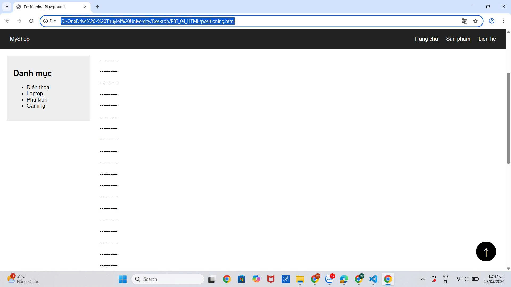
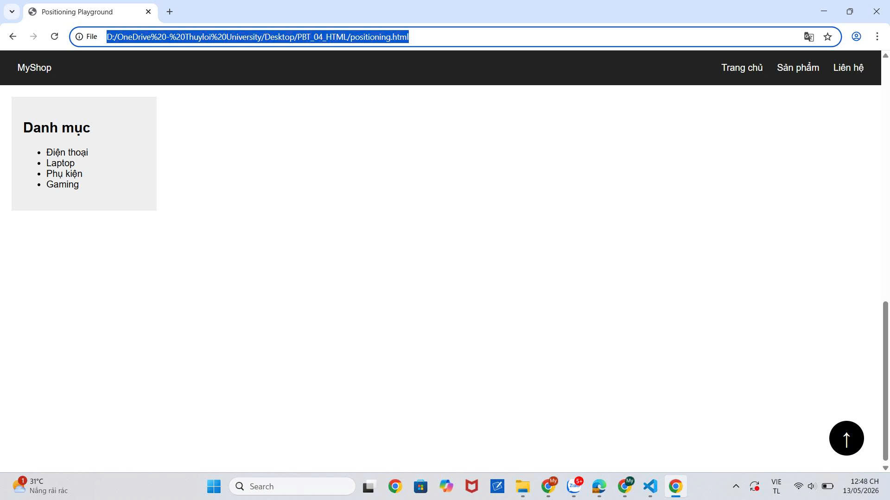
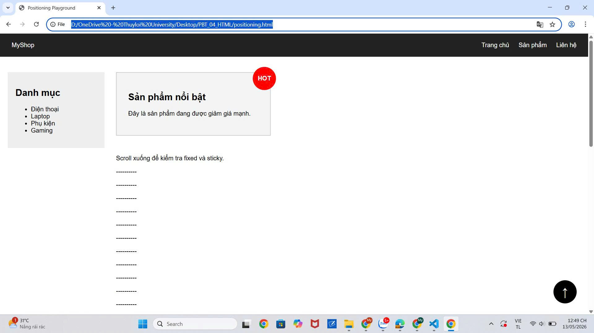
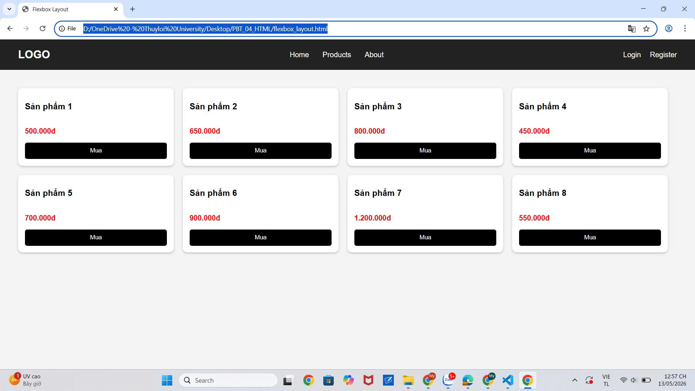
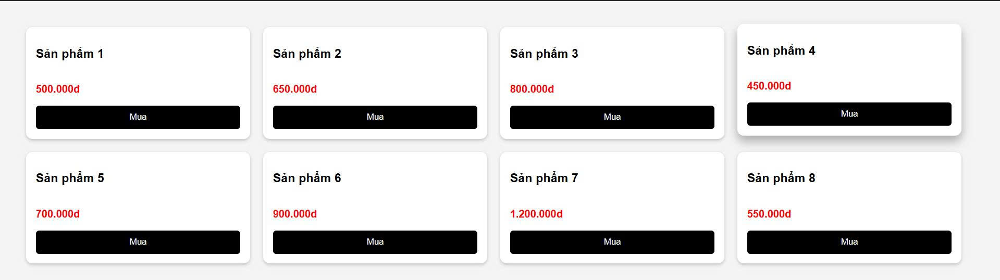
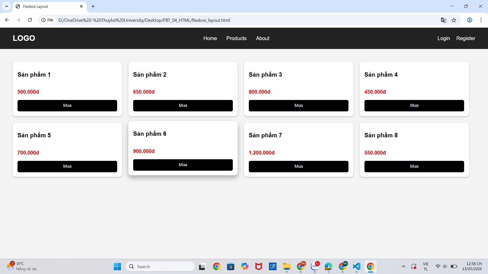
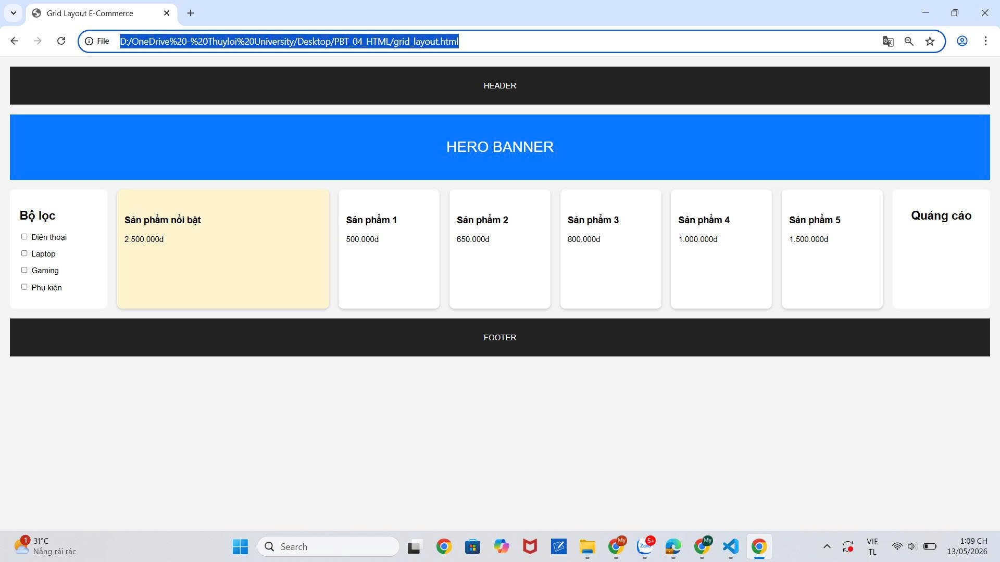
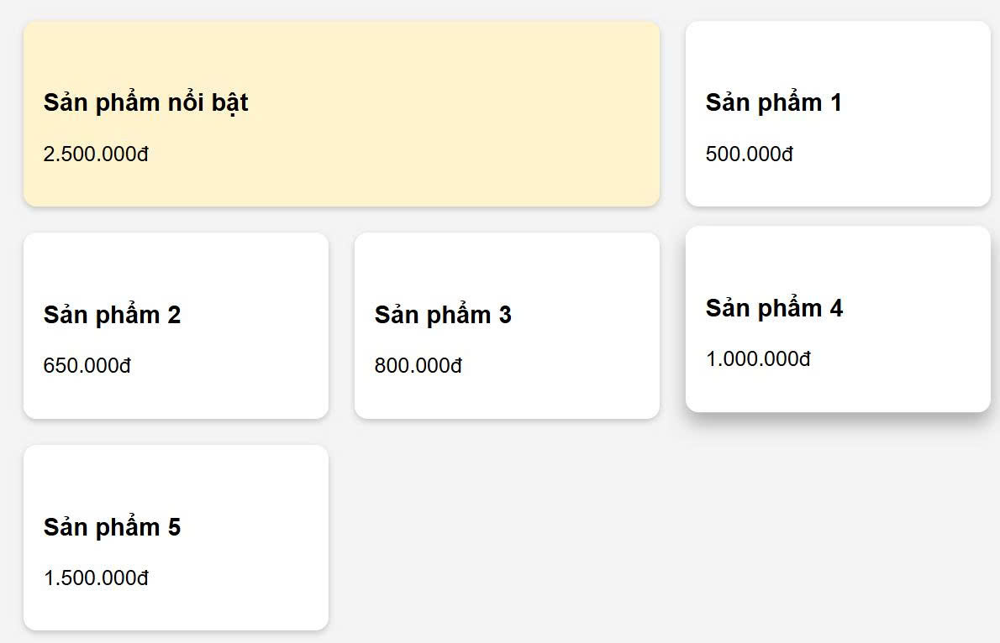
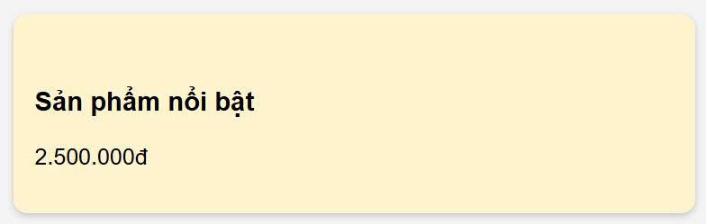
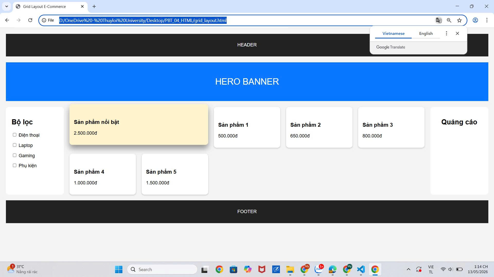

# Phần A

## Câu A1

| Position | Vẫn chiếm chỗ trong flow? | Tham chiếu vị trí | Cuộn theo trang? | Use case |
|---|---|---|---|---|
| static | Có | Theo vị trí mặc định của document | Có | Layout bình thường |
| relative | Có | Chính vị trí ban đầu của nó | Có | Dịch chuyển element, làm mốc cho absolute |
| absolute | Không | Parent gần nhất có position khác static | Có | Tooltip, popup, dropdown |
| fixed | Không | Viewport (cửa sổ trình duyệt) | Không | Navbar cố định, nút back to top |
| sticky | Có | Parent/container khi scroll | Ban đầu cuộn theo trang, tới ngưỡng thì đứng yên | Sticky menu, sticky header |

---

### Câu hỏi thêm

Absolute sẽ tham chiếu tới body hoặc viewport khi không có parent nào có:

```css
position: relative;
position: absolute;
position: fixed;
position: sticky;
```

Absolute sẽ tham chiếu tới parent khi parent gần nhất có:

```css
position khác static

Ví dụ

.parent {
    position: relative;
}

.child {
    position: absolute;
}
```
"Nearest positioned ancestor" nghĩa là phần tử tổ tiên gần nhất có:

```css
position khác static
Absolute sẽ dùng phần tử đó để tính:
top
left
right
bottom
Ví dụ
html
<div class="grandparent">
    <div class="parent">
        <div class="child"></div>
    </div>
</div>
css
.grandparent {
    position: relative;
}

.parent {
    position: static;
}

.child {
    position: absolute;
    top: 0;
}
Trong trường hợp này .child sẽ tham chiếu tới .grandparent vì .parent vẫn là static
```
## Câu A2

### Trường hợp 1
```css
Bố cục sẽ gồm 4 items nằm trên cùng 1 hàng.
| Item 1 | Item 2 | Item 3 | Item 4 |
display: flex; 
-> làm các item sắp xếp theo chiều ngang.
flex: 1;
->làm tất cả item chia đều chiều rộng container nên các item có kích thước bằng nhau.
```
### Trường hợp 2
```css
Bố cục sẽ gồm:
3 hàng, 2 cột
| Item 1 | Item 2 |
| Item 3 | Item 4 |
| Item 5 | Item 6 |
Mỗi item có:
45% width + 2.5% margin trái + 2.5% margin phải
= 50%
->Nên mỗi hàng chỉ chứa được 2 item.
flex-wrap: wrap;
cho phép item xuống dòng khi không đủ chỗ.
Có 6 items nên sẽ tạo thành 3 hàng.
```
### Trường hợp 3
```css
Bố cục:
| Item 1               Item 2               Item 3 |
justify-content: space-between;
làm item đầu sát trái, item cuối sát phải và item giữa nằm ở khoảng giữa.
align-items: center;
làm các item căn giữa theo chiều dọc.
Tất cả item nằm trên cùng 1 hàng vì flex mặc định sắp xếp theo chiều ngang.
```
### Trường hợp 4
```css
Bố cục:
| 200px |     flexible     | 200px |
| Item1 |      Item2       | Item3 |
Grid tạo 3 cột:
Cột 1 = 200px
Cột 2 = 1fr
Cột 3 = 200px
1fr nghĩa là chiếm toàn bộ phần không gian còn lại.
Có 3 items nên mỗi item nằm trên 1 cột.
gap: 20px;
tạo khoảng cách 20px giữa các cột.
```
### Trường hợp 5
```css
Bố cục:
| Item 1 | Item 2 | Item 3 |
| Item 4 | Item 5 | Item 6 |
| Item 7 |
grid-template-columns: repeat(3, 1fr);
tạo 3 cột bằng nhau.
Mỗi hàng chứa được 3 item.
Có 7 items nên:
Hàng 1 chứa item 1 → 3
Hàng 2 chứa item 4 → 6
Hàng 3 chỉ còn item 7
Item 7 nằm ở:
Hàng thứ 3, cột thứ 1
Hai ô còn lại của hàng cuối sẽ trống.
```
# Phần B
## Câu B1:







## Câu B2
Screenshot







## Câu B3









# Phần C

## Câu C1
```css
1. Navigation bar ngang
Dùng:
```text
Flexbox
Navbar là layout 1 chiều theo hàng ngang.
Flexbox phù hợp để:
căn logo bên trái
menu ở giữa
buttons bên phải
căn giữa theo chiều dọc dễ dàng
Ví dụ:
LOGO | MENU | BUTTONS
2. Lưới ảnh Instagram
Dùng:
Grid
Instagram là layout dạng lưới gồm nhiều hàng và cột.
Grid phù hợp vì:
dễ tạo 3 cột bằng nhau
tự động xuống hàng
quản lý layout 2 chiều tốt hơn Flexbox
Ví dụ:
| Ảnh 1 | Ảnh 2 | Ảnh 3 |
| Ảnh 4 | Ảnh 5 | Ảnh 6 |
3. Layout blog
Dùng:
Kết hợp Grid + Flexbox
Grid dùng cho layout tổng thể:
Sidebar | Main Content
Flexbox dùng bên trong từng phần để:
căn menu
sắp xếp nội dung
căn chỉnh item nhỏ
Grid mạnh về bố cục lớn, Flexbox mạnh về bố cục nhỏ.
4. Footer với 4 cột thông tin
Dùng:
Grid
Footer có nhiều cột song song nên Grid phù hợp hơn.
Grid giúp:
chia đều 4 cột
căn chỉnh dễ dàng
responsive tốt
Ví dụ:
| Về chúng tôi | Liên kết | Hỗ trợ | Liên hệ |
5. Card sản phẩm
Dùng:
Flexbox
Card sản phẩm là layout 1 chiều theo cột:
Ảnh
Tên
Giá
Nút mua
Flexbox phù hợp với:
flex-direction: column;
và có thể dùng:
margin-top: auto;
để nút "Mua" luôn dính đáy card.
```
## Câu C2
### Lỗi 1 — Cards không đều chiều cao

Nguyên nhân:
Các card có lượng nội dung khác nhau nên chiều cao mỗi card khác nhau.
Nút: mua
-> không được đẩy xuống đáy card nên bị lệch lên/xuống.

### Code sửa 
```css
.card-container {
    display: flex;
    flex-wrap: wrap;
}

.card {
    width: 30%;
    margin: 1.5%;

    display: flex;
    flex-direction: column;
}

.card img {
    width: 100%;
}

.card h3 {
    font-size: 18px;
}

.card .btn {
    padding: 10px;

    margin-top: auto;
}
```
Giải thích:
```css
display: flex;
flex-direction: column;
biến card thành flex container theo chiều dọc.
margin-top: auto;
đẩy nút xuống đáy card.
Kết quả:
các nút nằm thẳng hàng
card đều đẹp hơn
```
### Lỗi 2 — Item không nằm giữa màn hình
Nguyên nhân: .hero chỉ có: display: flex; nhưng chưa dùng:

justify-content
align-items

->nên content vẫn nằm góc trái trên.
### Code sửa
```css
.hero {
    height: 100vh;

    display: flex;

    justify-content: center;

    align-items: center;
}

.hero-content {
    text-align: center;
}
```
Giải thích
```css
justify-content: center;
căn giữa theo chiều ngang.

align-items: center;
căn giữa theo chiều dọc.

-> .hero-content nằm chính giữa màn hình.
```
### Lỗi 3— Sidebar bị co lại
Nguyên nhân: Flexbox mặc định cho phép flex item co lại bằng:

flex-shrink: 1;

->Khi content quá dài, sidebar bị ép nhỏ lại.
### Code sửa
```css
.layout {
    display: flex;
}

.sidebar {
    width: 250px;

    flex-shrink: 0;
}

.content {
    flex: 1;
}
```
Giải thích

flex-shrink: 0;

ngăn sidebar bị co nhỏ.

->sidebar luôn giữ đúng:
250px

dù content dài bao nhiêu


